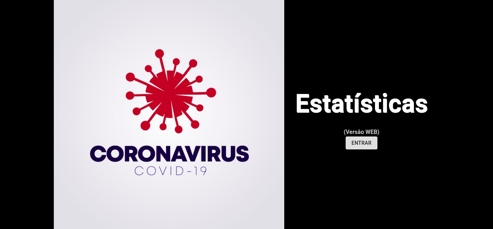
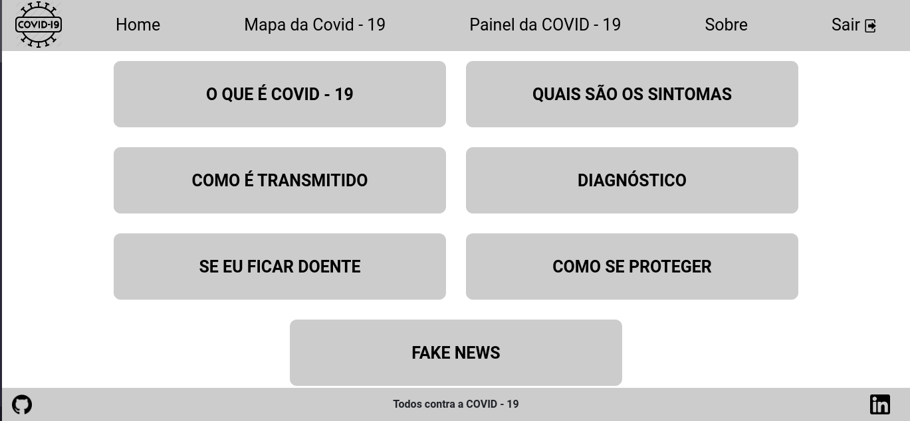
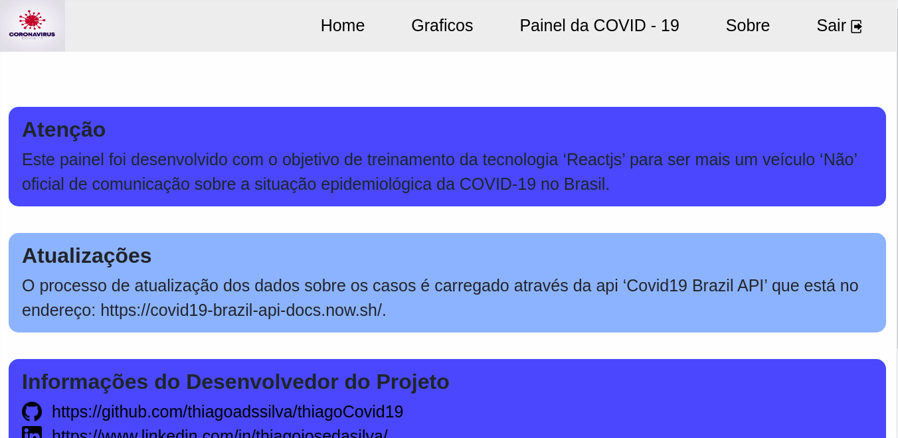
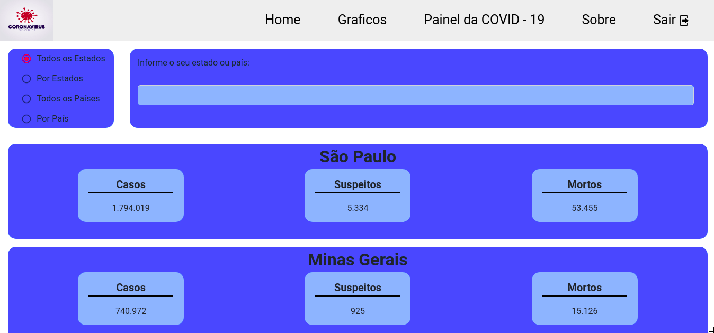

# Projeto COVID-19
* Projeto em Reactjs, onde vou está aplicando alguns conceitos aprendidos e com algumas modificações, esse projeto vai mostrar as estatisticas sobre o covid19 e com algumas informações a mais.

* Dentro do <b>README</b> da pasta do projeto está tudo que está sendo usando.
   * https://github.com/thiagoadssilva/thiagoCovid19/blob/main/frontend/README.md

## Protótipo criado com a plataforma 'FIGMA'
  * https://www.figma.com/proto/RMgm71Fx6cXt8INJdpRKfz/PROJETO-COVID?node-id=0%3A3&scaling=scale-down

## Projeto Publicado
- http://listatarefa.tfcoder.com/???

## <b>Tela de Inicio</b> 

## <b>Tela HOME</b> 

## <b>Tela SOBRE</b> 

## <b>Tela do PAINEL DA COVID-19</b> 

