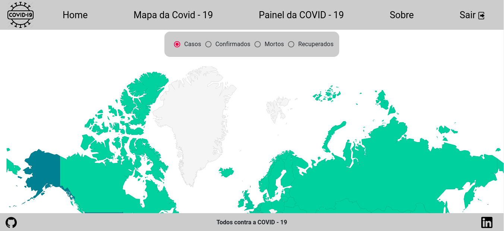
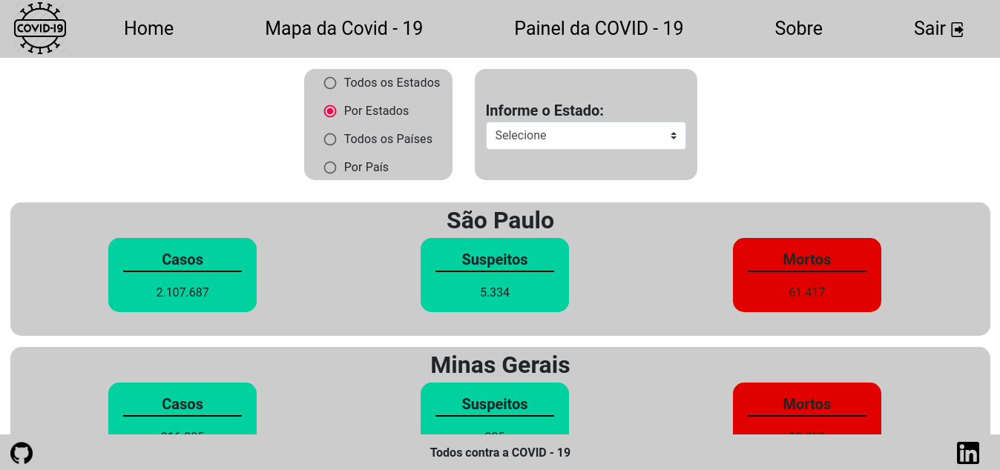
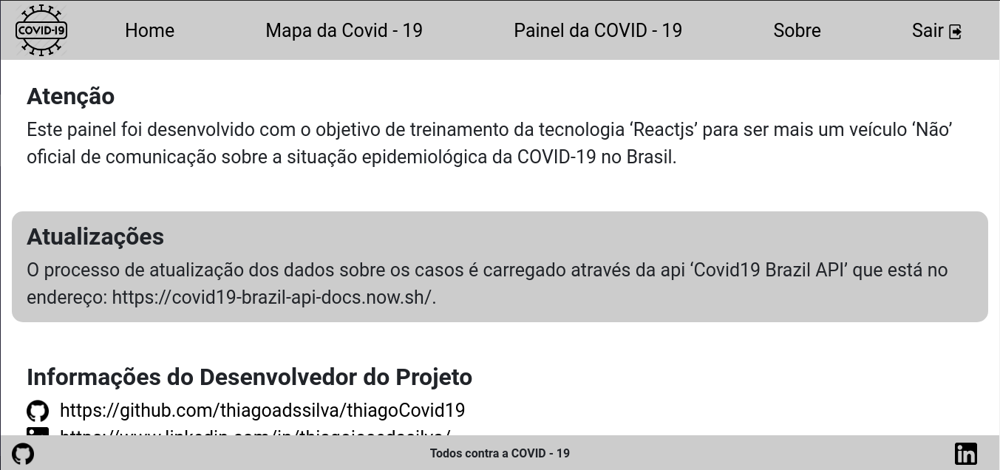

# Projeto COVID-19
* Projeto em Reactjs, onde vou está aplicando alguns conceitos aprendidos e com algumas modificações, esse projeto vai mostrar as estatisticas sobre o covid19 e com algumas informações a mais.

* Dentro do <b>README</b> da pasta do projeto está tudo que está sendo usando.
   * https://github.com/thiagoadssilva/thiagoCovid19/blob/main/frontend/README.md

## Protótipo criado com a plataforma 'FIGMA'
  * https://www.figma.com/proto/RMgm71Fx6cXt8INJdpRKfz/PROJETO-COVID?node-id=0%3A3&scaling=scale-down

## Projeto Publicado
- http://covid19.tfcoder.com/

## <b>HOME SCREEN</b> 

## <b>HOME</b> 

## <b>Mapa da Covid - 19</b> 

## <b>PAINEL DA COVID-19</b> 

## <b>SOBRE</b> 

## <b>O QUE É COVID - 19</b> 

## <b>QUAIS SÃO OS SINTOMAS</b> 

## <b>COMO É TRATAMENTO</b> 

## <b>DIAGNÓSTICO</b> 

## <b>SE EU FICAR DOENTE</b> 

## <b>COMO SE PROTEGER</b> 

## <b>FAKE NEWS</b> 

